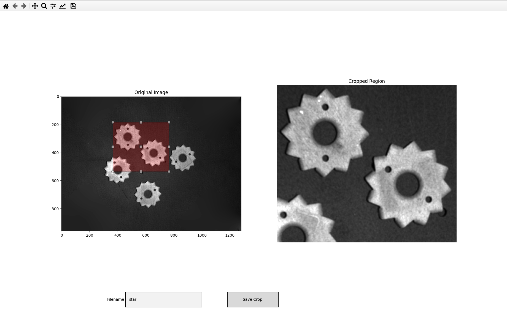

# Simple Image Cropper Tool

A simple interactive Python tool to crop images with bounding box selection using matplotlib.

## Usage

```
python simple_image_cropper.py --image_path <path_to_image> 
```

## Example



## How it works

1. The left subplot shows the original image.
2. Draw a rectangle with the mouse to select the crop region.
3. The right subplot previews the cropped region.
4. Enter a filename in the textbox below.
5. Click "Save Crop" to save the crop as a .tif image in the output folder.


